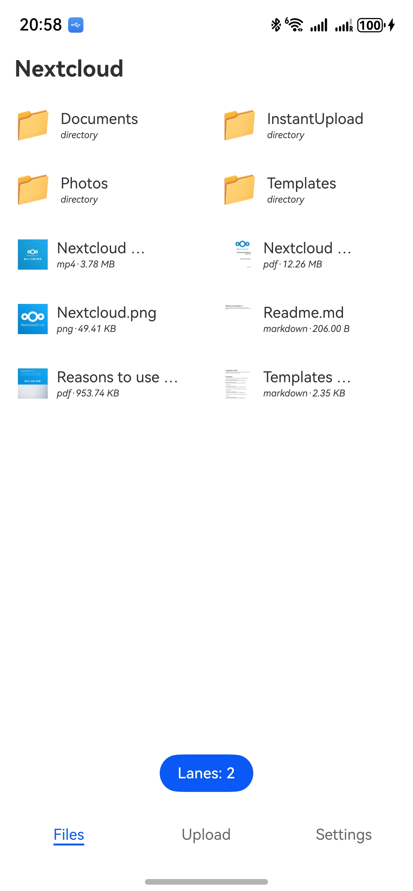

# Nextcloud Client for HarmonyOS

This is an early version of Nextcloud Client on HarmonyOS.

## Update Timeline

- 2025.10.19: settings page & media upload now preserves the file's original mtime
- 2025.10.18: login page out-of-box-experience updates
- 2025.10: development is restarted? focus more on ui
- 2025.10: finally found out the missing `ohos.permission.MEDIA_LOCATION`, where TF are the docs???
- 2025.05: still not figuring out why GPS coords are lost, this makes me nearly abandon the project
- 2025.03: photo uploading works, except the gps locations are lost
- 2025.02: login works, directory browsing works, but nothing more
- 2024.12: creation of an idea of writing such a client

Supported Features:

- Logging in
- Listing Files
- Navigating Among Folders
- Uploading Photos with GPS data, categoried by RegExp of the photo file name
    - So sad they don't have an API for `getImageSourceApp'
- Previewing Photos/Files that has a preview

## Screenshots

<kbd>
    </img>
    </img>
    </img>
    </img>
    </img>
</kbd>

## Contributions

Contributors are ALWAYS welcomed.
